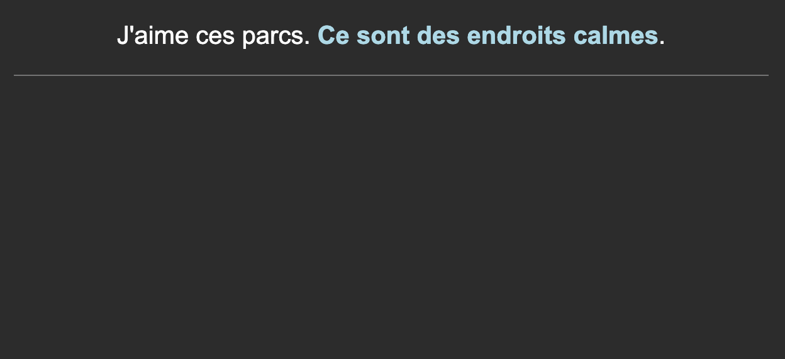
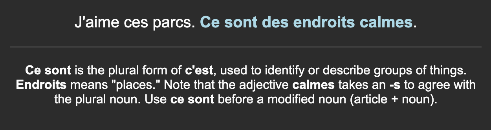

# Anki Automation Tools

A collection of AI-powered scripts to automate and enhance Anki deck management using Google's Gemini AI.

## Scripts Overview

- **Note Augmenter (`augment_deck.py`):** Automatically generates explanations, grammar points, and context for empty "Notes" fields.
- **Mnemonic Generator (`augment_mnemonic.py`):** Creates creative mnemonics for Japanese vocabulary based on meaning, shape, and sound.
- **Deck Analyzer (`analyze_deck.py`):** A utility for inspecting the internal structure and field mapping of `.apkg` files.

---

## 1. Note Augmenter (`augment_deck.py`)

This tool generates helpful explanations for cards that have an empty "Notes" field.

### Features
- **AI-Powered Explanations:** Uses Gemini 3 Flash Preview for context-aware notes.
- **Two Modes:** Modifies `.apkg` files directly or updates via AnkiConnect.
- **Smart Filtering:** Only targets empty fields.
- **Parallel Processing:** Efficiently handles large decks.

### Requirements
- **Field Names:** By default, the script expects fields named **"Text"** (the source text) and **"Notes"** (the target for the AI-generated content). You can modify these in the `Configuration` section at the top of `augment_deck.py` if your deck uses different naming conventions.

| Before | After |
| --- | --- |
|  |  |

### Usage
```bash
# AnkiConnect Mode (Recommended)
python augment_deck.py --anki-connect --note-type "My Model"

# File Mode
python augment_deck.py --input "MyDeck.apkg" --output "MyDeck_Augmented.apkg"
```

---

## 2. Mnemonic Generator (`augment_mnemonic.py`)

Generates creative mnemonics for Japanese vocabulary cards, specifically targeting meaning, shape (kanji), and sound (reading).

### Features
- **Reading-Aware:** Uses `ExpressionReading` to create phonetically relevant mnemonics.
- **Structured HTML:** Produces beautifully formatted sections for Meaning, Shape, and Sound.
- **AnkiConnect Ready:** Seamlessly updates your Japanese decks.

### Requirements
- **Field Names:** The script expects the following fields:
  - **"Expression"**: The Japanese word or phrase.
  - **"ExpressionReading"**: The reading (furigana/kana) for phonetic mnemonics.
  - **"Mnemonic"**: The target field for the generated content.
  These can be adjusted in the script's constants if needed.

### Usage
```bash
# Basic usage (defaults to "Lapis" note type)
python augment_mnemonic.py

# With custom note type and dry run
python augment_mnemonic.py --model-name "Japanese Vocab" --dry-run
```

---

## General Prerequisites & Installation

### Prerequisites
- Python 3.9+
- A Google Gemini API Key
- (Optional) Anki with the [AnkiConnect](https://ankiweb.net/shared/info/2055492159) add-on.

### Installation
1. **Clone the repository.**
2. **Install dependencies:**
   ```bash
   pip install -r requirements.txt
   ```
3. **Set up API Key:**
   ```bash
   export GEMINI_API_KEY="your_api_key_here"
   ```

## Disclaimer

**Important:** These scripts were generated with the assistance of Large Language Models (LLMs). Automated modification of Anki databases carries inherent risks. Always **back up your original Anki decks** before use. The authors are not responsible for any data loss or corruption.