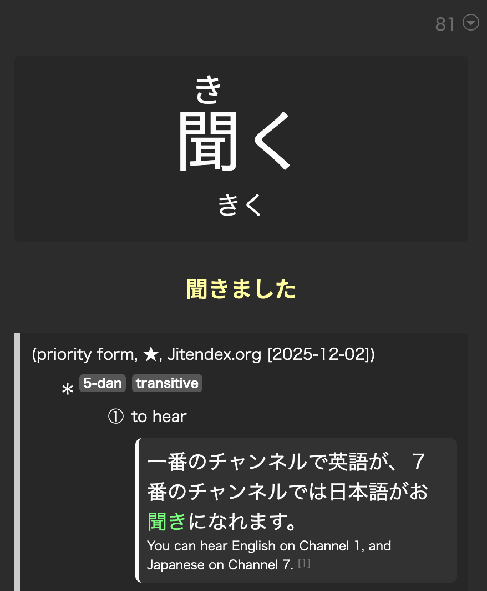
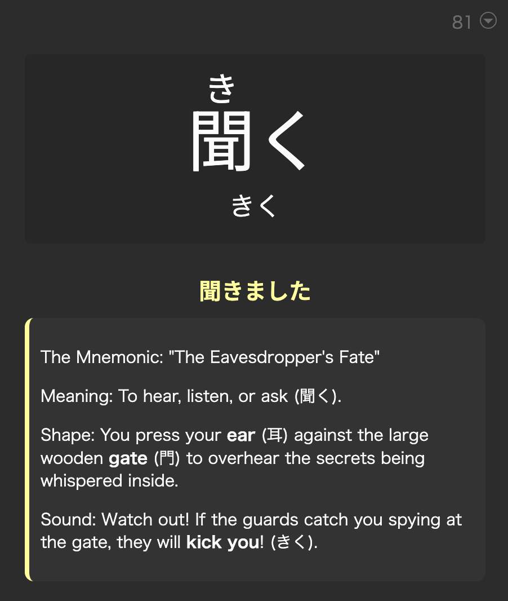

# Anki Automation Tools

A collection of AI-powered scripts to automate and enhance Anki deck management using Google's Gemini AI or your preferred LLM tool.

## Scripts Overview

- **(`augment_notes.py`):** Automatically generates content (notes, mnemonics, etc.) for your Anki cards using configurable AI prompts and target fields.

---

## `augment_notes.py`

This tool fills empty fields in your Anki cards with AI-generated content based on other fields in the card.

### Features
- **Configurable Prompts:** Use `{FieldName}` placeholders in your prompt to dynamically insert content from the card.
- **Custom Targets:** Specify any field as the destination for the generated content.
- **AI-Powered:** Uses LiteLLM for intelligent generation, supporting Gemini, Ollama, and more.
- **Two Modes:** Modifies `.apkg` files directly or updates via AnkiConnect.
- **Smart Filtering:** Only targets cards where the destination field is empty.
- **Parallel Processing:** Efficiently handles large decks.

### Usage

#### Explain a sentence in the Cloze Format

I have a deck with sentences in French like `Sur ça, tu touches un point {{c1::assez juste::fairly accurate}}, je trouve.`. I use the prompt [./french_explain_prompt.txt](./french_explain_prompt.txt) to extract the "Text" field and generate an explanation for the word and sentence and store it in the "Notes" field.

| Before | After |
| --- | --- |
|  |  |


```bash
python augment_notes.py \
  --anki-connect \
  --note-type "My French" \
  --target-field "Notes" \
  --prompt-file "./french_explain_prompt.txt"
```

#### Generating Mnemonics for Kanji

I have a Japanese mining deck created with Yomitan's scanning of Kanji words `聞く`. I use the prompt [./kanji_mnemonic_prompt.txt](./kanji_mnemonic_prompt.txt) to extract multiple fields in my card and generate a mnemonic. The mnemonic ends up being a great way to remember the Meaning, Shape and Sound.

| Before | After |
| --- | --- |
|  |  |

```bash
python augment_notes.py \
  --anki-connect \
  --note-type "Lapis" \
  --target-field "Notes" \
  --prompt-file "./kanji_mnemonic_prompt.txt"
```

### Command Line Arguments

- `--anki-connect`: Use AnkiConnect to update a running Anki instance.
- `--input`, `--output`: Input and output `.apkg` files (for file mode).
- `--note-type`: **(Required)** The Anki Note Type to process.
- `--target-field`: **(Required)** The field to populate (e.g. "Notes", "Mnemonic").
- `--prompt-file`: **(Required)** Path to a text file containing the custom prompt template. Use `{FieldName}` for placeholders.
- `--model`: LiteLLM model identifier (e.g., `gemini/gemini-1.5-flash`, `ollama/qwen2.5:4b`). Default: `gemini/gemini-2.5-flash`.
- `--dry-run`: Preview changes without applying them.

---

## General Prerequisites & Installation

### Prerequisites
- Python 3.9+
- A Google Gemini API Key
- Anki with the [AnkiConnect](https://ankiweb.net/shared/info/2055492159) add-on.

### Installation
1.  **Clone the repository.**
2.  **Install dependencies:**
    ```bash
    pip install -r requirements.txt
    ```
3.  **Set up API Key:**
    ```bash
    export GEMINI_API_KEY="your_api_key_here"
    ```

## Disclaimer

**Important:** These scripts were generated with the assistance of Large Language Models (LLMs). Automated modification of Anki databases carries inherent risks. Always **back up your original Anki decks** before use. The authors are not responsible for any data loss or corruption.

**Cost Warning:** Using cloud-based LLM providers (like Google Gemini, OpenAI, etc.) may incur costs. Processing a large number of cards can lead to significant API usage and charges. Always check your provider's pricing and consider using a local model via Ollama or llama.cpp for large-scale operations.
