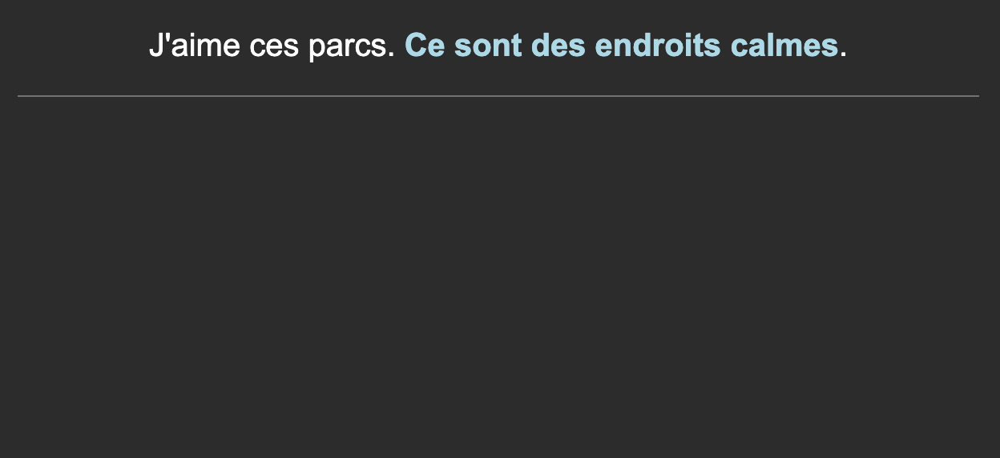
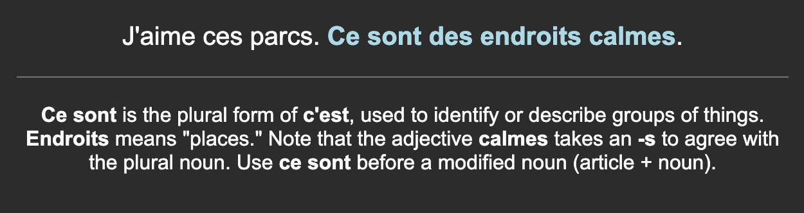
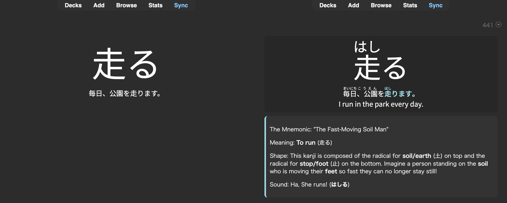

# Anki Decks & Workspace Skills

A collection of **AI Workspace Skills** designed to show useful information in Anki. You can use these skills to automatically fill in mnemonics, grammar explanations, or example sentences directly through your AI agent's chat interface.

## How it Works

These skills are stored in the `.gemini/skills/` directory. When you open this project with a compatible AI agent (like Gemini CLI), it **automatically discovers and loads** these skills.

## Quick Start

1. **Set up a virtual environment** (needed for vocabulary extraction):
   ```bash
   python3 -m venv .venv
   source .venv/bin/activate
   ```
2. **Install dependencies**:
   ```bash
   pip install -r requirements.txt
   ```
3. **Make sure [AnkiConnect](https://ankiweb.net/shared/info/2055492159) is installed** and Anki is running.
4. **Load the skills**: Use your AI agent's command to list or load workspace skills (e.g., `/skills list` in Gemini CLI).

---

## Workspace Skill: `anki-add-notes`

This skill orchestrates the AI augmentation of Anki notes. It scans your deck for empty fields and fills them using a prompt template read from a local file.

### Examples

#### 1. Explain Sentences
Takes a Cloze deletion like `Sur ça, tu touches un point {{c1::assez juste}}` and adds a detailed explanation to the "Notes" field.

| Before | After |
| --- | --- |
|  |  |

**Prompt:**
> Use anki-add-notes for deck "Language French::My french words and phrases", target field "Notes", and prompt file "./explain_prompt.txt".

#### 2. Generate Kanji Mnemonics
Uses the Kanji and its meaning to create a story that helps you remember the shape and sound.

| Card |
| --- |
|  |

**Prompt:**
> Use anki-add-notes for deck "Language Japanese::Mining", target field "Notes", and prompt file "./kanji_mnemonic_prompt.txt".

#### 3. Translate Sentences
Translates a field (like "Expression") into your target language, automatically cleaning Anki cloze markers.

**Prompt:**
> Use anki-add-notes for deck "Language Hindi::My hindi words and phrases", target field "ExpressionEnglish", and prompt file "./translate_prompt.txt".

### Parameters
- `--deck`: (Required) The Anki Deck Name to process.
- `--target-field`: (Required) The field you want to fill (e.g., "Notes").
- `--prompt-file`: (Required) Path to your prompt template. Use `{FieldName}` placeholders to pull data from your cards. See the bundled [Explanation](./explain_prompt.txt), [Kanji](./kanji_mnemonic_prompt.txt), [Translation in English](./translate_prompt.txt), [Translation in Japanese (furigana)](./translate_ja_prompt.txt) templates for examples.
- `--limit`: (Optional) Limit the number of notes processed. Defaults to `20`.
- `--sort-field`: (Optional) The field to use for sorting notes. Defaults to `Frequency`.
- `--interactive` / `-i`: (Optional) Review every AI response before it hits your deck.
- `--dry-run`: (Optional) List the notes that would be processed without calling the AI.

---

## Workspace Skill: `anki-monolingual-hints`

Transform Anki cloze deletion hints from English to concise monolingual cues (definitions, synonyms, or grammar cues) in the target language, while preserving the original English hint in parentheses. Use this to help users "think" in the target language.

### Example

**Prompt:**
> Use anki-monolingual-hints for deck "Language French::My french words and phrases". Process 5 notes.

### Strategy Priority (with English hint in parentheses)
1. **Zero Hint:** Only the English hint (e.g., `{{c1::de::(of)}}`).
2. **Definition (TL):** Simple definition + English (e.g., `{{c1::voiture::véhicule (car)}}`).
3. **Synonym/Antonym (TL):** `=` or `≠` + English (e.g., `{{c1::triste::≠ content (sad)}}`).
4. **Grammar Cue:** Conjugation or rule label + English (e.g., `{{c1::suis::présent (am)}}`).

**Rules:**
- **Encourage Abbreviations:** Use short forms (e.g., `p.c.` for `passé composé`, `f.` for `féminin`) to keep the hint as small as possible.
- **No Self-Reference:** Cues never contain the target word or its root.
- **Conciseness:** Hints are kept as short as possible.

### Parameters
- `--deck`: (Required) The Anki Deck Name to process.
- `--target-field`: (Optional) Field with the cloze deletions. Defaults to `Expression`.
- `--limit`: (Optional) Limit processing. Defaults to `5`.
- `--interactive` / `-i`: (Optional) Review every transformation.
- `--dry-run`: (Optional) Preview results only.

---

## Workspace Skill: `anki-add-sentence`

Generates **i+1 example sentences** for learning targets. It ensures sentences only use vocabulary you've already learned (by automatically running `extract_learned_vocab.py`) plus the single target word.

### Example

**Prompt:**
> Use anki-add-sentence for deck "Language Japanese::Mining". Process 5 notes.

### Parameters
- `--deck`: (Required) The Anki Deck Name to process.
- `--source-field`: (Optional) Field with the target word. Defaults to `Expression`.
- `--target-field`: (Optional) Field for the generated sentence. Defaults to `Sentence`.
- `--target-field-english`: (Optional) Field for the English translation. Defaults to `SentenceEnglish`.
- `--limit`: (Optional) Limit processing. Defaults to `20`.
- `--batch-size`: (Optional) Notes per AI request. Defaults to `5`.
- `--dry-run`: (Optional) Preview words to be processed.

---

## Workspace Skill: `anki-add-frequency`

Estimates how common a word or phrase is in a conversational setting (scale 1-1000) and fills an Anki field. 1 is very common, 1000 is rare.

### Example

**Prompt:**
> Use anki-add-frequency for deck "Language Hindi::My hindi words and phrases". Process 10 notes.

### Parameters
- `--deck`: (Required) The Anki Deck Name to process.
- `--target-field`: (Optional) Field for the frequency number. Defaults to `Frequency`.
- `--limit`: (Optional) Limit processing. Defaults to `20`.
- `--batch-size`: (Optional) Notes per AI request. Defaults to `5`.
- `--dry-run`: (Optional) Preview results only.

---

## Workspace Skill: `anki-backup-deck`

Backup an Anki deck to a single `.apkg` binary file. Use this before making significant changes to your deck.

### Example

**Prompt:**
> Use anki-backup-deck to backup the "Language French::My french words and phrases" deck to anki_backups/.

---

## Meta Prompts

Meta prompts combine multiple skills into a single powerful workflow. These are useful for processing large batches of new notes across multiple dimensions (frequency, explanations, and translations).

### French Deck Monolingualization
Full augmentation for new French notes, adding frequency data, detailed explanations, and converting English cloze hints into concise monolingual cues.

**Prompt:**
```text
In the deck "Language French::My french words and phrases":
- use the skill anki-add-frequency.
- use the skill anki-add-notes with the target field "Notes" and the prompt file "./explain_prompt.txt".
- use the skill anki-add-notes with the target field "ExpressionEnglish" and the prompt file "./translate_prompt.txt".
- use the skill anki-monolingual-hints.

Process a limit of 200 notes with a batch size of 50. Parallelize where possible. Prefer atomic changes.
```

### Japanese Mining Deck Augmentation
Comprehensive augmentation for Japanese mining notes, adding frequency, mnemonics, monolingual hints, and i+1 sentences.

**Prompt:**
```text
In the deck "Language Japanese::Mining":
- use the skill anki-add-frequency.
- use the skill anki-add-notes with the target field "Notes", and prompt file "./kanji_mnemonic_prompt.txt".
- use the skill anki-add-sentence.

Process a limit of 200 notes with a batch size of 50. Parallelize where possible. Prefer atomic changes.
```

### Hindi Deck Augmentation
Full augmentation for new Hindi notes, adding frequency data, detailed grammar/cultural notes, and English translations.

**Prompt:**
```text
In the deck "Language Hindi::My hindi words and phrases":
- use the skill anki-add-frequency.
- use the skill anki-add-notes with the target field "Notes" and the prompt file "./explain_prompt.txt".
- use the skill anki-add-notes with the target field "ExpressionFurigana" and the prompt file "./translate_ja_prompt.txt".
- use the skill anki-add-notes with the target field "ExpressionEnglish" and the prompt file "./translate_prompt.txt".

Process a limit of 200 notes with a batch size of 50. Parallelize where possible. Prefer atomic changes.
```

---

## Important Notes

- **Back up your deck** using `anki-backup-deck` before running skills that modify your database.
- **AnkiConnect** must be configured to allow your AI agent to talk to Anki.
- Check your agent's documentation to verify that all workspace skills are properly loaded.

License: MIT
